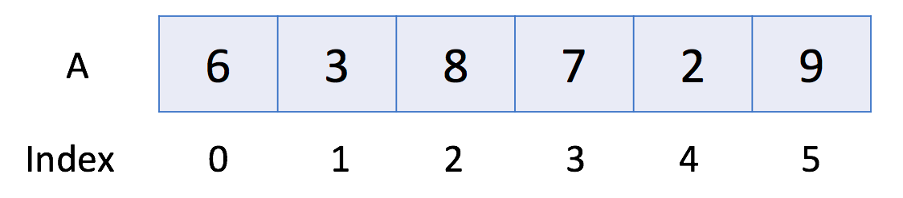

# Introduction to Array

An array is a basic data structure to store a collection of elements sequentially. But elements can be accessed randomly
since each element in the array can be identified by an array index.

An array can have one or more dimensions. Here we start with the one-dimensional array, which is also called the linear
array. Here is an example:



In the above example, there are 6 elements in array A. That is to say, the length of A is 6. We can use A[0] to
represent the first element in the array. Therefore, A[0] = 6. Similarly, A[1] = 3, A[2] = 8 and so on.

## Operations in Array

Let's take a look at the usage of the array.

```java
// "static void main" must be defined in a public class.
public class Main {
    public static void main(String[] args) {
        // 1. Initialize
        int[] a0 = new int[5];
        int[] a1 = {1, 2, 3};
        // 2. Get Length
        System.out.println("The size of a1 is: " + a1.length);
        // 3. Access Element
        System.out.println("The first element is: " + a1[0]);
        // 4. Iterate all Elements
        System.out.print("[Version 1] The contents of a1 are:");
        for (int i = 0; i < a1.length; ++i) {
            System.out.print(" " + a1[i]);
        }
        System.out.println();
        System.out.print("[Version 2] The contents of a1 are:");
        for (int item: a1) {
            System.out.print(" " + item);
        }
        System.out.println();
        // 5. Modify Element
        a1[0] = 4;
        // 6. Sort
        Arrays.sort(a1);
    }
}
```

- [Content](200-introduction.md)
- [Home](../index.md)